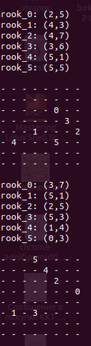

Description
-----------

This is toy game with chess rooks. I was proposed to solve this task by [Kaspersky][1] guys after tech interview.

What is the goal?

> Suppose you have a chess board with 8x8 size and 6 rooks at random cells. These rooks starts to move randomly
> and simultaneously: vertically or horizontally. Each rook takes delay in 200-300ms after each move.
> Game for rook is ended once it faces with other one or once it performed 50 moves. It's need to print initial
> and final rooks positions and to have fun.

[1]: https://antidrone.kaspersky.com/en/

Build and Run
-------------

```bash
$ ./build-n-run.sh
```

Test Environment
----------------

+ Ubuntu-18.04
+ Ubuntu-20.04
+ build-essential
+ C++17

Sample Output
-------------



It's fun . . .
